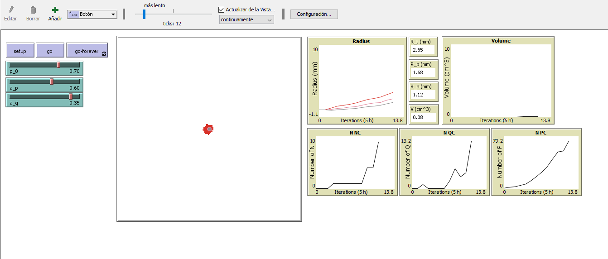
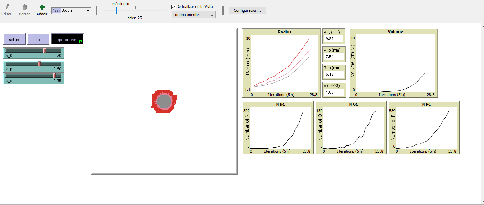
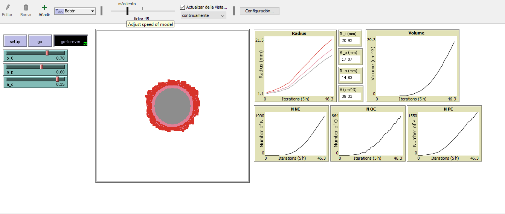
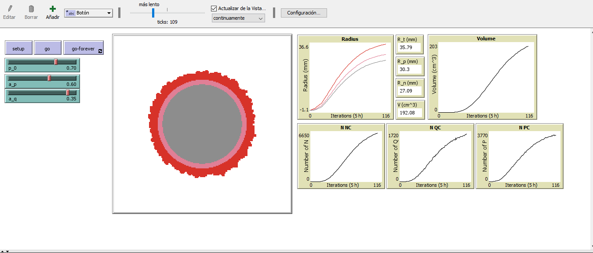
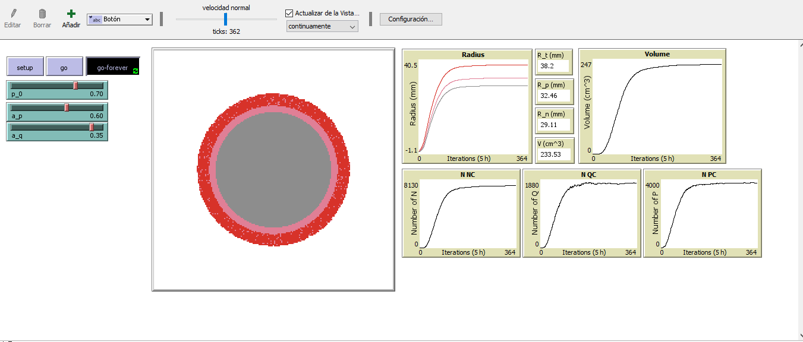

# chemotherapy-effects-SCAM
A cellular automata model of chemotherapy effects on tumour growth (based on https://doi.org/10.1080/13873954.2019.1571515)

Overleaf Mem: https://es.overleaf.com/read/cnrydrtxhjvg

## Proliferation algorithm

First version of proliferation algorithm.

Parameters used in the images:

* p_0 = 0.70
* a_p = 0.60
* a_q = 0.35

1. After 12 ticks

2. After 25 ticks

3. After 45 ticks

4. After 119 ticks

5. After 362 ticks

